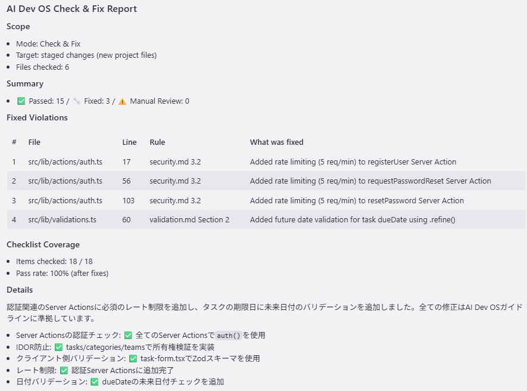

# AI Dev OS Plugin — Kiro

[](../../../LICENSE)

AI Dev OS 4계층 모델을 Kiro의 Steering Rules와 Hooks 시스템에 통합하는 플러그인입니다.

**[AI Dev OS](https://github.com/yunbow/ai-dev-os)의 일부** — 암묵지를 강제 가능한 AI 코딩 규칙으로 변환하는 프레임워크 ([Lifespan Layers](https://github.com/yunbow/ai-dev-os#lifespan-layers--the-4-layer-model)).
프로젝트에 [AI Dev OS Rules](https://github.com/yunbow/ai-dev-os-rules-typescript) 설정이 필요합니다.

## 왜 이 플러그인인가?

AI Dev OS 가이드라인을 **Kiro의 스티어링 시스템**에 통합:

- **11 Steering Rules** — `#ai-dev-os-check`, `#ai-dev-os-scan`, `#ai-dev-os-extract` 등
- **3 Auto Steering** — 철학 어드바이저, 원칙 체커, 가이드라인 감사
- **2 File Match Rules** — 코드 파일 자동 검사, L1-L2 의존성 경고
- **원커맨드 설정** — `npx ai-dev-os init --rules typescript --plugin kiro`



## 빠른 시작

```bash
npx ai-dev-os init --rules typescript --plugin kiro
```

> CLI는 서브모듈 추가, AGENTS.md 템플릿 복사, 스티어링 규칙과 훅의 `.kiro/` 복사를 자동으로 수행합니다.
> 자세한 내용은 [AI Dev OS CLI](https://github.com/yunbow/ai-dev-os-cli)를 참조하세요.

전제 조건: [Kiro](https://kiro.dev/) >= 1.0.0 및 프로젝트에 AI Dev OS 레이어 파일(L1-L3) ([TypeScript](https://github.com/yunbow/ai-dev-os-rules-typescript) / [Python](https://github.com/yunbow/ai-dev-os-rules-python)).

<details>
<summary>수동 설정</summary>

**방법A: 서브모듈**

```bash
# 1. AI Dev OS rules를 서브모듈로 추가
git submodule add https://github.com/yunbow/ai-dev-os-rules-typescript.git docs/ai-dev-os
# Python 프로젝트의 경우:
# git submodule add https://github.com/yunbow/ai-dev-os-rules-python.git docs/ai-dev-os

# 2. 이 플러그인을 서브모듈로 추가
git submodule add https://github.com/yunbow/ai-dev-os-plugin-kiro.git .kiro/plugins/ai-dev-os
cp -r .kiro/plugins/ai-dev-os/steering/ .kiro/steering/
cp -r .kiro/plugins/ai-dev-os/hooks/ .kiro/hooks/
```

**방법B: 직접 복사**

```bash
# 1. 규칙을 서브모듈로 추가 (위와 동일)
git submodule add https://github.com/yunbow/ai-dev-os-rules-typescript.git docs/ai-dev-os

# 2. 플러그인을 클론하여 복사
git clone https://github.com/yunbow/ai-dev-os-plugin-kiro.git
cp -r ai-dev-os-plugin-kiro/steering/ .kiro/steering/
cp -r ai-dev-os-plugin-kiro/hooks/ .kiro/hooks/
```

3. Kiro 채팅에서 `#ai-dev-os-init`을 호출하여 4계층 구조 설정
4. 코딩 시작 — 스티어링 규칙과 훅이 자동으로 안내합니다

자세한 내용은 [운영 가이드](./operation-guide.md)를 참조하세요.

</details>

## Steering Rules

### 수동 스티어링 (채팅에서 `#name`으로 호출)

| 스티어링 규칙 | 호출 | 설명 |
|--------------|------|------|
| **Init** | `#ai-dev-os-init` | 설정 마법사 — 30분 만에 프로젝트에 AI Dev OS 도입 |
| **Check** | `#ai-dev-os-check` | 코드 변경의 가이드라인 준수 검사 (`git diff`, 스테이징, 브랜치 비교 지원) |
| **Scan** | `#ai-dev-os-scan` | 프로젝트 전체 소스 파일의 완전한 준수 스캔 |
| **Review** | `#ai-dev-os-review` | PR 전 셀프 리뷰 — L3 준수 + L2 설계 리뷰 + L1 정합성 통합 검사 |
| **Extract** | `#ai-dev-os-extract` | 코드 리뷰 차이에서 새 규칙 추출 (Rule Harvesting) |
| **Why** | `#ai-dev-os-why` | 규칙의 근거를 L3→L2→L1까지 추적하여 설명 |
| **Plan** | `#ai-dev-os-plan` | 코딩 전 가이드라인 체크리스트가 포함된 구현 계획 생성 |
| **Ticket** | `#ai-dev-os-ticket` | 구현 요약과 체크리스트 후보가 포함된 티켓 생성 (로컬 파일 또는 GitHub Issue) |
| **Audit** | `#ai-dev-os-audit` | 4계층 건전성 감사: 의존성 규칙, 신선도, 커버리지, 일관성 |
| **Evolve** | `#ai-dev-os-evolve` | 최근 커밋을 분석하여 L1-L2 업데이트 제안 (SECI 스파이럴) |
| **Report** | `#ai-dev-os-report` | 팀과 이해관계자를 위한 준수 요약 보고서 생성 |

### 자동 스티어링 (자동 활성화)

| 스티어링 규칙 | 활성화 조건 | 설명 |
|--------------|------------|------|
| `philosophy-advisor` | 아키텍처/설계 결정 | L1 기반 판단 지원 |
| `principle-checker` | 코드 변경 논의 | L2 정합성 검증 |
| `guideline-auditor` | 가이드라인 유지보수 논의 | L3 커버리지 및 일관성 감사 |

### 파일 매치 스티어링 (매칭 파일에서 자동 활성화)

| 스티어링 규칙 | 파일 패턴 | 설명 |
|--------------|----------|------|
| `guideline-compliance` | `**/*.{ts,tsx,py,go,js,jsx}` | 코드 파일의 경량 가이드라인 검사 |
| `layer-dependency` | `**/01_philosophy/**`, `**/02_decision-criteria/**` | 의존성 규칙 위반 경고 |

## Hooks

| 이벤트 | 트리거 | 동작 |
|--------|--------|------|
| File Save | 코드 파일 | 가이드라인 준수 빠른 검사 |
| Pre Tool Use (terminal: git commit) | 커밋 전 | `#ai-dev-os-check` 실행 리마인더 |
| User Prompt Submit | 구현 관련 프롬프트 | `#ai-dev-os-plan` 제안 |

<details>
<summary>패키지 구성</summary>

```
ai-dev-os-plugin-kiro/
├── steering/
│   ├── ai-dev-os-init.md              # 설정 마법사 (수동)
│   ├── ai-dev-os-check.md             # 가이드라인 준수 검사 (수동)
│   ├── ai-dev-os-scan.md              # 프로젝트 전체 준수 스캔 (수동)
│   ├── ai-dev-os-review.md            # PR 전 셀프 리뷰 (수동)
│   ├── ai-dev-os-extract.md           # 코드 Rule Harvesting (수동)
│   ├── ai-dev-os-why.md               # 규칙 근거 설명 (수동)
│   ├── ai-dev-os-plan.md              # 가이드라인 기반 구현 계획 (자동)
│   ├── ai-dev-os-ticket.md            # 티켓 생성 (수동)
│   ├── ai-dev-os-audit.md             # 4계층 건전성 감사 (수동)
│   ├── ai-dev-os-evolve.md            # SECI 스파이럴 피드백 (수동)
│   ├── ai-dev-os-report.md            # 준수 보고서 생성 (수동)
│   ├── philosophy-advisor.md          # L1 철학 기반 판단 지원 (자동)
│   ├── principle-checker.md           # L2 원칙 정합성 검증 (자동)
│   ├── guideline-auditor.md           # L3 커버리지 및 일관성 감사 (자동)
│   ├── guideline-compliance.md        # 코드 파일 자동 검사 (파일 매치)
│   └── layer-dependency.md            # 의존성 규칙 경고 (파일 매치)
├── hooks/
│   └── hooks.json                     # 라이프사이클 이벤트 훅
├── checklist-templates/
│   ├── python.md                      # Python 전용 체크리스트
│   ├── go.md                          # Go 전용 체크리스트
│   └── nextjs.md                      # Next.js 전용 체크리스트
├── templates/
│   ├── AGENTS.md.template             # AGENTS.md 템플릿 (캐스케이드 포함)
│   ├── ai-dev-os-starter/             # 최소 구성 템플릿
│   └── ai-dev-os-full/                # 전체 4계층 템플릿
└── docs/
    └── operation-guide.md             # 상세 운영 가이드
```

</details>

## Specificity Cascade

규칙 충돌 시: framework-specific > common > project-specific > decision criteria > philosophy. [→ 상세](https://github.com/yunbow/ai-dev-os/blob/main/spec/priority-cascade.md)

## 관련 프로젝트

| 저장소 | 설명 |
|--------|------|
| [ai-dev-os](https://github.com/yunbow/ai-dev-os) | 프레임워크 사양과 이론 |
| [ai-dev-os-rules-typescript](https://github.com/yunbow/ai-dev-os-rules-typescript) | TypeScript / Next.js / Node.js 가이드라인 |
| [ai-dev-os-rules-python](https://github.com/yunbow/ai-dev-os-rules-python) | Python / FastAPI 가이드라인 |
| [ai-dev-os-plugin-claude-code](https://github.com/yunbow/ai-dev-os-plugin-claude-code) | Claude Code의 Skills, Hooks, Agents |
| [ai-dev-os-plugin-cursor](https://github.com/yunbow/ai-dev-os-plugin-cursor) | Cursor Rules (.mdc) |
| [ai-dev-os-cli](https://github.com/yunbow/ai-dev-os-cli) | 설정 자동화 — `npx ai-dev-os init` |

## 라이선스

[MIT](../../../LICENSE)

---

Languages: [English](../../../README.md) | [日本語](../ja/README.md) | [简体中文](../zh-CN/README.md) | 한국어 | [Español](../es/README.md)
